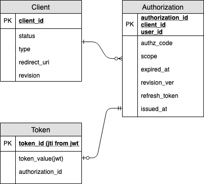

# oauth-az-backend

# Package Structure

This repository is constructed using Go's `Flat Package Architecture`.

```
├── domain
│   └── token.go         // Domain logic (Model)
├── go.mod
├── go.sum
├── handler        
│   ├── response        // View Layer
│   │   └── token.go
│   └── token.go        // Business Logic
├── infrastructure      // Tech Layer
│   ├── in_memory_db.go
│   └── rds.go
└── main.go
```

OAuth itself is a well-defined protocol.
So the repository's `business logic` is not exactly the one like in normal web app.
Rather, the OAuth itself should be one under business logic.
But, since this repository is purpose for education, let's put OAuth logic under domain layer.  

# DB

## Table Design (Conceptual Schema in Logical Definition)



* draw.io link: https://drive.google.com/file/d/1l2Ft-nnS4i0Ubtpf1wK3IfQBt2DyX9Ln/view?usp=sharing

## Tools

* orm: [SQLBoiler](https://github.com/volatiletech/sqlboiler)
* migration tool: [sql-migrate](https://github.com/rubenv/sql-migrate)

# Set up

## Server environment
* running env: docker container
* port: 8080
* config file location: /etc/oauth-az/config.toml

One can customize parameters by adding `--build-args` in docker build command 

## App Environment
* The default parameters
    * debug: false 
* Build Using Docker
```
% docker build -f Dockerfile -t oauth-az-back-dev .
% docker run -it --rm -p 8080:8080 --name oauth-az-back oauth-az-back-dev:latest
```

* Install Dependencies
```
% go mod init
% vgo build
% vgo mod tidy
```

## DB Envinronment

* Initial setup

### Local Build

```

# Mount local directories for data persistence
% mkdir db
% sudo chmod -R 777 db

# Start 
% docker run --name mysql --restart always -v $(pwd)/db:/var/lib/mysql -v $(pwd)/db/config:/etc/mysql/conf.d -e MYSQL_ROOT_PASSWORD=password -p 3306:3306 -d mysql
% docker exec -it mysql /bin/bash
root@0caa697a9dcc:/# mysql -u root -p

# Create DB and DB user with a right amount privileges
mysql> CREATE DATABASE authz;
musql > CREATE USER 'oauth-as'@'{YOUR HOST, eg: %, localhost}' IDENTIFIED BY '{RANDOM SECURE PASSWORD}';
mysql > select User, Plugin from mysql.user;
mysql > GRANT {YOUR Privilege, eg: ALL PRIVILEGES} ON authz.* TO 'oauth-as'@'{YOUR HOST, eg: %, localhost}';
mysql > exit
root@0caa697a9dcc:/# exit

# Start Migration
% mkdir migrations/mysql
% sql-migrate new -env=development -config=dbconfig.yml authz-db-migration
```

# ToDo
* [ ] Implement OAuth
* [ ] Makefile
* [ ] Separate debug/prod envs